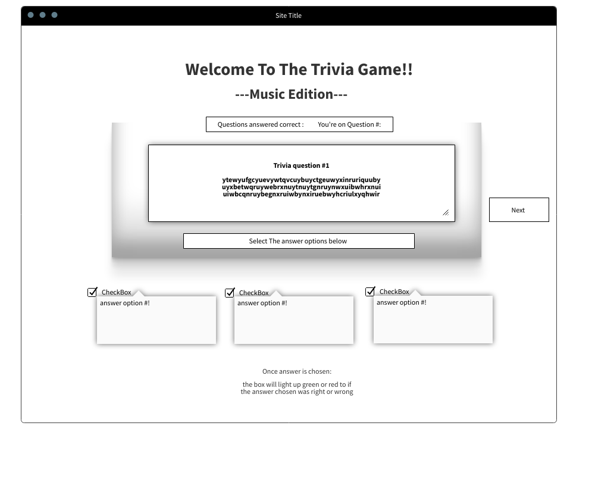

## ** Project 1 | Music Trivia**

## Set-up ##

## WireFrame ##

## MVP ##

- Click into a trivia game
- A trivia question appear with two answer choices
- Will go to next question Score will reflect right or wrong.
- reset and submit button.

## Game Instructions ##

Instructions:
                <ul>Welcome to Music Trivia!
                So, Music is Pretty Great Right? 
                Well, now you can test your knowleage!
                </ul>
                    <li>Scoreboard/Points: The scoreboard sits right 
                    above the trivia question. Each correct question 
                    equals 1 point. There are a total of 14 questions.</li>
                    <li>Below the Scoreboard, you will see the Trivia 
                    Question. Below that, sits 2 possible answers but only 
                    1 is correct. Click on the answer that you beleive 
                    is correct. "Click"!! Once you click, You will see
                    the results reprented on the ScoreBoard.</li>
                    <li>To the Left you will see a Reset Button. If you 'Click', This will Reset the game for you. </li>
                    <li>To the right you will see a Submit Button. If you 'Click', your score will be submitted. HighScore Features will be coming soon! </li>
                    <li> Lastly, We can't have Music Trivia without Music!! Above the Scoreboard 
                    sits a spotify playlist. You can scroll through and 'Click", on some Funky tunes
                    to jam to, or just "Click", Play! 
                    </li>
                

##**Reference**##
https://simplestepscode.com/javascript-quiz-tutorial/

https://simplestepscode.com › javascript-quiz-tutorial

https://www.w3schools.com/js/js_quiz.asp

https://github.com/bd6981/Trivia-/raw/Portfolio/trivia.png